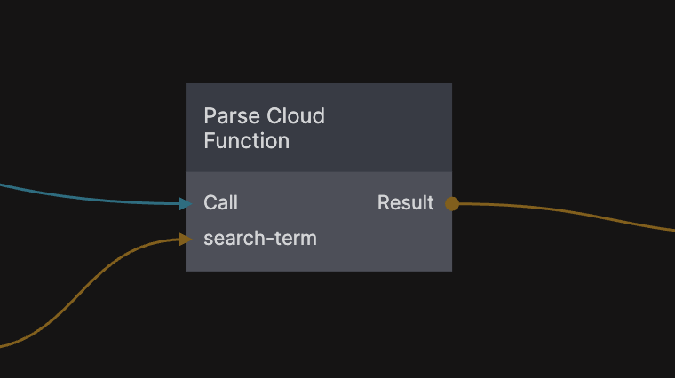
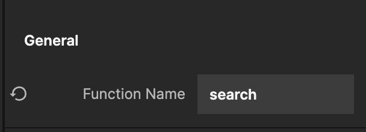
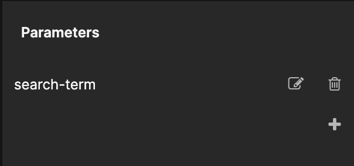

<##head##>

# Parse Cloud Function

This node is used to make calls to [Parse Platform](https://parseplatform.org) cloud functions. To use Parse cloud functions you need to have an external Parse backend and have attached cloud functions-

You need to specify the name of the cloud function you want to call. This is done via the **Function Name** property.

You can also provide parameters that you want to be passed to the cloud function by adding them using the **Parameters** property. Once a parameter is added the corresponding input is available on the node. You provide the input values via regular Noodl connections.

The cloud function returns the result of the cloud function on the **Result** output. 

<##head##>

## Inputs

| Data                                                | Description                                                                                                                                      |
| --------------------------------------------------- | ------------------------------------------------------------------------------------------------------------------------------------------------ |
| Function Name     | <##input:functionName##>The name of the cloud function to call.<##input##>                                                                       |
| Custom Parameters | <##input:pm-*##>A parameter that will be passed to the function. Any parameters you add will become available as inputs on the node.<##input##> |

| Signal                                   | Description                                                                                 |
| ---------------------------------------- | ------------------------------------------------------------------------------------------- |
| Call | <##input:call##>Send a signal on this input to issue the request to the backend.<##input##> |

## Outputs

| Data                                     | Description                                                                                                              |
| ---------------------------------------- | ------------------------------------------------------------------------------------------------------------------------ |
| Result | <##output:result##>This output will contain the result that the **Cloud Function** returns upon completion. <##output##> |

| Signal                                      | Description                                                                                              |
| ------------------------------------------- | -------------------------------------------------------------------------------------------------------- |
| Success | <##output:success##>This is sent if the function returns a success code and a result object.<##output##> |
| Failure | <##output:failure##>This is sent if the function returns a failure code.<##output##>                        |
