# Encoding Parameters In URLs

## What you will learn in this guide

This guide will teach you how to pass parameters in the URL when you are navigating between pages, either as the final part of a path, e.g. "mysite.com#/path/parameter" or as query strings, "mysite.com#/path?parameter1=val1&parameter2=val2".
Noodl is handling this through its [Page Inputs](/nodes/navigation/page-inputs/) node and [Navigate](/nodes/navigation/navigate/) node.

The main reason to encode data needed by a **Page Component** in URLs rather than using regular data nodes is that the data becomes independent of the App state. For example

-   If a user refreshes the browser running the App, the data will still be available to the **Page Component** in the URL.
-   If a user want to be able to share the exact state of an App with another user, you can encode that state in the URL.

## Overview

The guide will cover the following

-   Pass data to a **Page Component** as a **Path Parameter**
-   Navigate to a path and set the **Path Parameter**
-   Pass data to a **Page Component** using a **Query Parameter**

The guide assumes that you are familiar with basic Web Navigation concepts and it's suggested that you have already gone through the [Basic Navigation](/guides/navigation/web-navigation/basic-navigation/) and [Multi Level Navigation](/guides/navigation/web-navigation/multi-level-navigatio/) guides before you go through this guide.

We will also use the example app developed as part of the two guides as a starting point in this guide. If you haven't built it already, you can import it by clicking the button below and follow the instructions in Noodl.

<div className="ndl-image-with-background l">
    </img>
<button className="ndl-import-button" onClick='importIntoNoodl("docs/guides/navigation/encoding-parameters-in-urls/multi-level-navigation.zip",{name:"Multi Level Navigation",thumb:"docs/guides/navigation/encoding-parameters-in-urls/multi-level-thumb.png"})'></button>
</div>

## Path Parameters

To demonstrate a typical use of **Path Parameters** we will have to create a list of products to show in our app.

### Listing Products

The App will focus on Melee weapons.
In the main App component, create a [Static Array](/nodes/data/array/static-array/) node. Make sure its set to `CSV` type. Edit the CSV data and paste in the data from below.

```
name,category,description,price,identifyer
Katana,steel,A classic japanese weapon used by the samurais,2000,katana
Broadsword,steel,A favorite among the medieval knights,1800,broadsword
Morning Star,steel,A scary and heavy weapon that require an expert to handle,1200,morning-star
Wooden Club,wood,A cheap and easy to use weapon that's popular among the farmers,50,wooden-club
Bokken,wood,A japanese wooden sword used in Kendo,850,bokken
Fake two handed sword,plastic,Looks real but so much lighter than the real thing,400,fake-sword
Mace for practice,plastic,A plastic mace you can use for training,250,plastic-mace
```

Feel free to add more data to the dataset if you want, as long as the category is one of "steel"/"wood"/"plastic". Also make sure the the "identifyer" value of any new row you add does not contain any whitespaces.

<div className="ndl-image-with-background l">

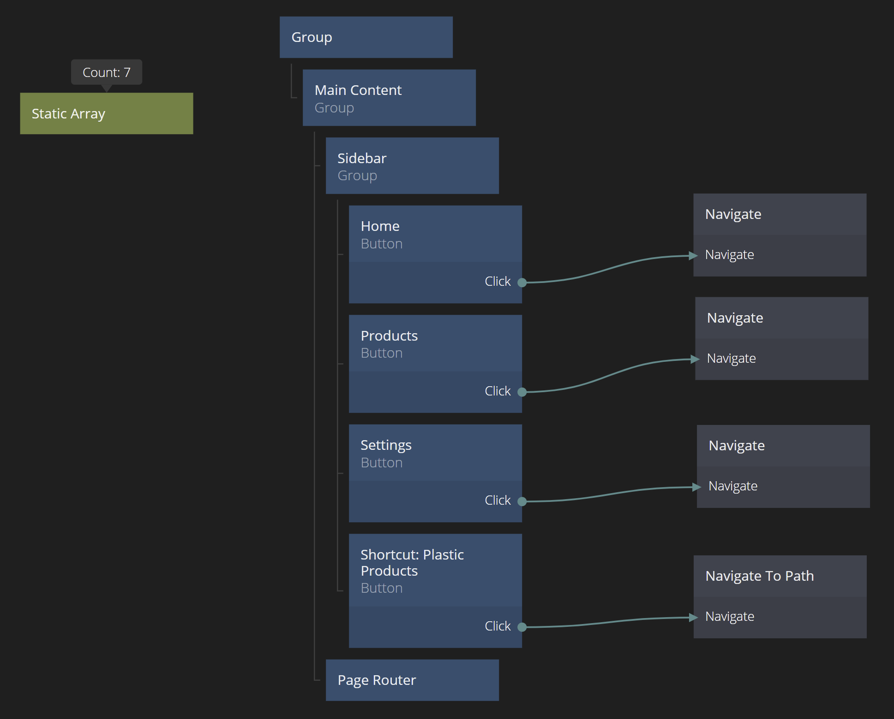

</div>

Ok, now lets list the products under the Products page with their category, i.e. any "steel" products should be listed on the products/steel page.

First we put the Products in an Array that we can find anywhere in the app. Create an [Array](/nodes/data/array/array/) node next to the **Static Array**. Give it the **Id** `Products`. Then connect the output **Items** on the **Static Array** to the input **Items** on the **Array**.

<div className="ndl-image-with-background l">

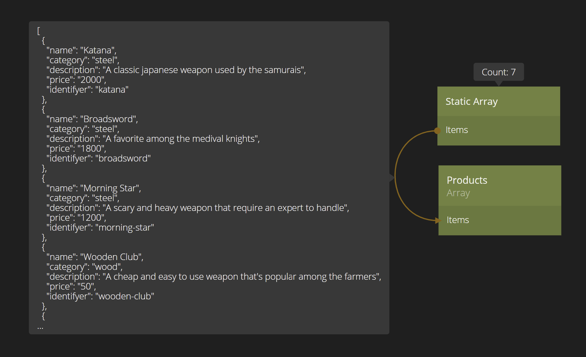

</div>

Now we will go into the "Steel" Product Page and list the products of the "steel" category. We will use a [Repeater](/nodes/ui-elements/repeater/) and create a list item.

In the steel page, add a **Repater** node as the second child of the group. Also add an **Array** node. Make sure its **Id** is `Products`, i.e. the same array that we filled with the product data. Then connect the **Items** output of the **Array** connects to the **Items** input of the **Repeater**.

<div className="ndl-image-with-background l">

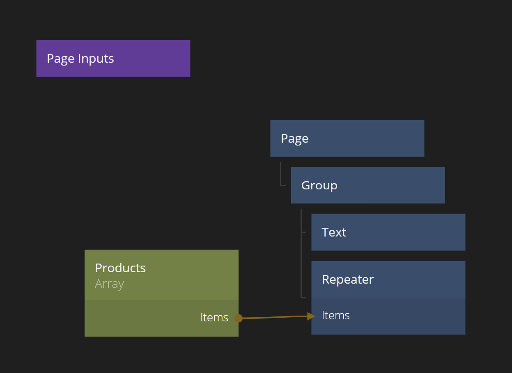

</div>

We will still not see anything because we have no list item that the **Repeater** can use to visualize the items. So lets create a new component, we call it "Product Item". In the new component we add a **Text** node as the only child in the **Group**. Now we need to retrieve the individual **Object** that contains the Product entry. Create an [Object](/nodes/data/object/) node and make sure it gets its **Id** from the repeater node. Also add a property "name" to the **Object**.

<div className="ndl-image-with-background m">

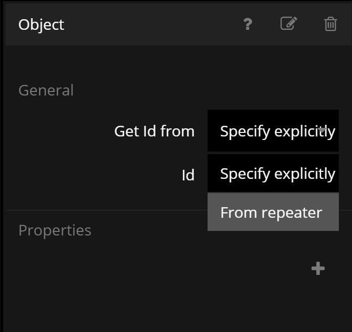

</div>

<div className="ndl-image-with-background m">

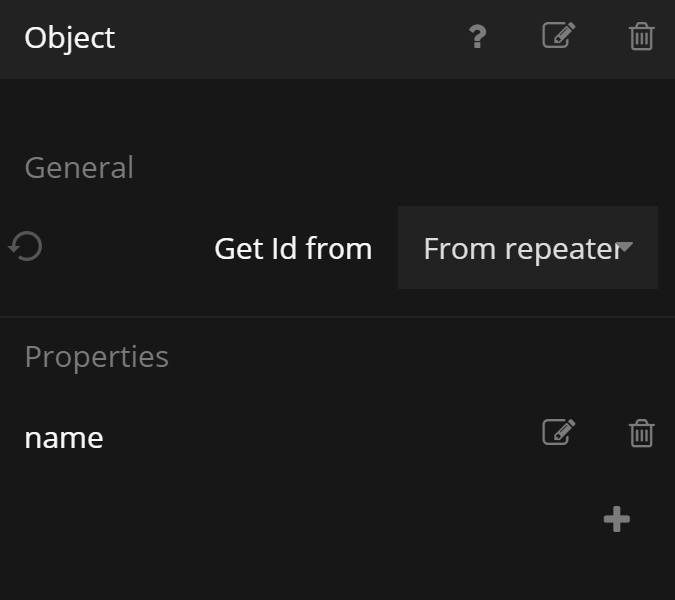

</div>

Finally hook up the **name** output of the **Object** with the **text** property of the **Text** node. We will have something like image below.

<div className="ndl-image-with-background m">

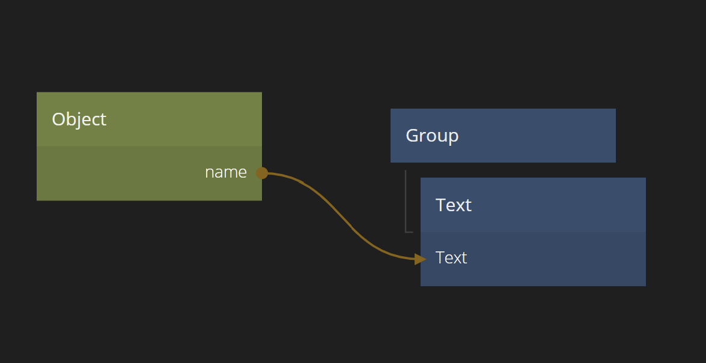

</div>

Now we are ready to go back to the "Steel" page and select our newly created List Item as the List Item of the repeater.

<div className="ndl-image-with-background">

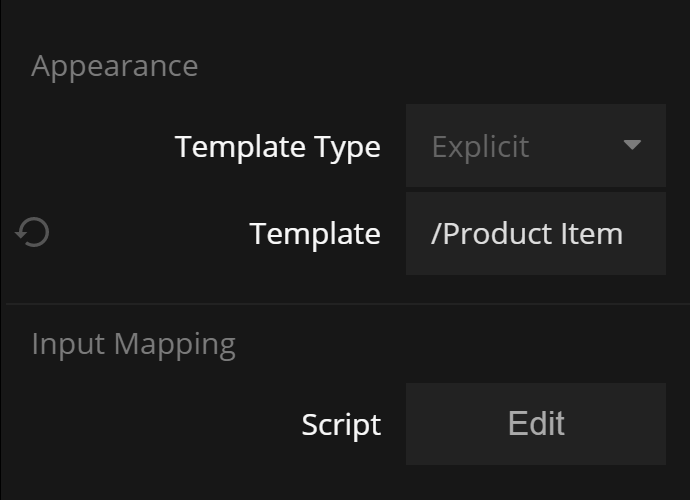

</div>

If you navigate to the "Steel" page, you should now see a bunch of items popping up. It should look something like this:

<div className="ndl-image-with-background">

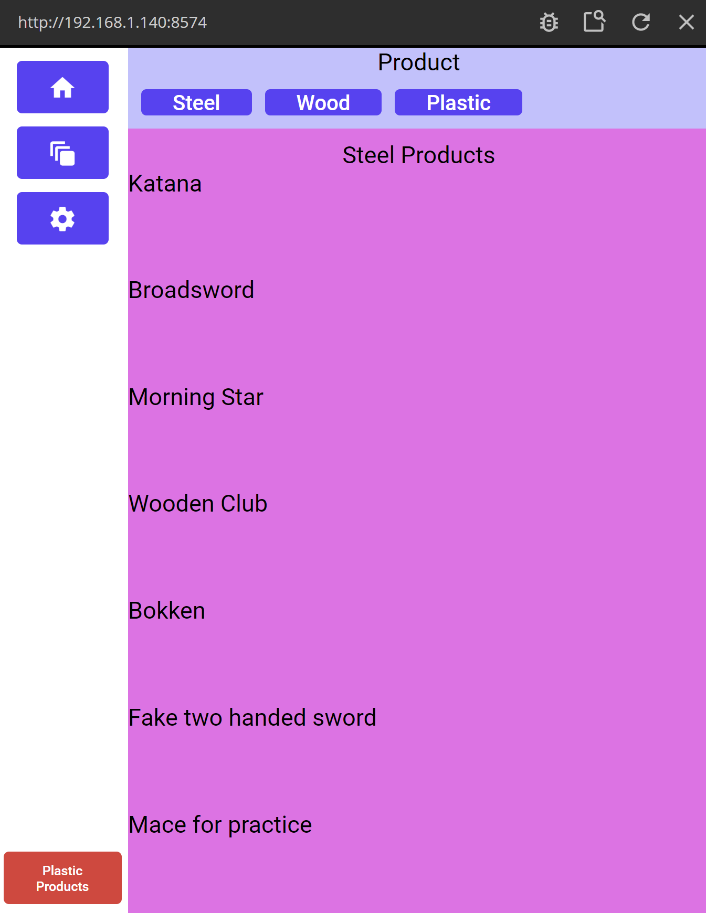

</div>

We immediately see two things

-   The list items need to be styled
-   We see all products, not only the ones in the "steel" category

To fix the styling we go back into the "Product Item" component, make sure the **Group** node is **Content Height** (so the list gets a bit more compact). We also add a **Hover State** on the **Text** node. There is plenty of more styling that can be done, but lets settle for now.

Secondly, to filter out the products of the "steel" category, we go back to the "Steel Products" Page Component.

We add in a [Array Filter](/nodes/data/array/array-filter/) node in between the **Array** and **Repater**.

<div className="ndl-image-with-background l">

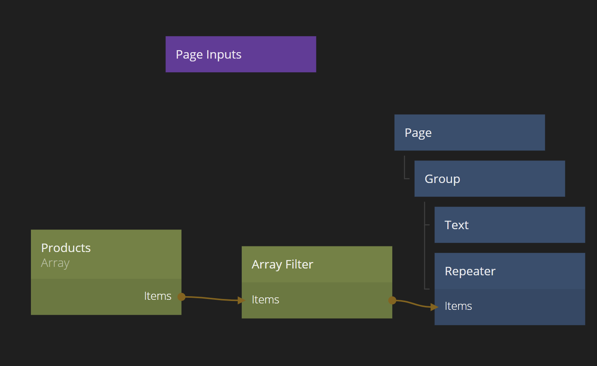

</div>

And finally we configure the **Array Filter** to only show items where `category = "steel"`.

<div className="ndl-image-with-background">

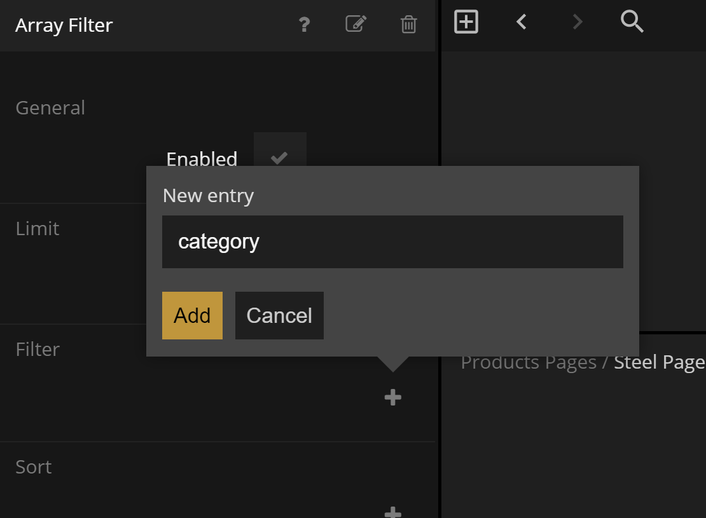

</div>

<div className="ndl-image-with-background">

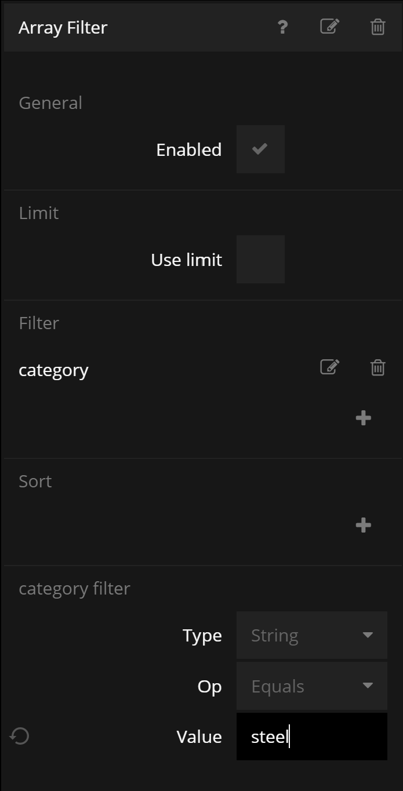

</div>

Now your Steel Page should look something like the one below.

<div className="ndl-image-with-background">

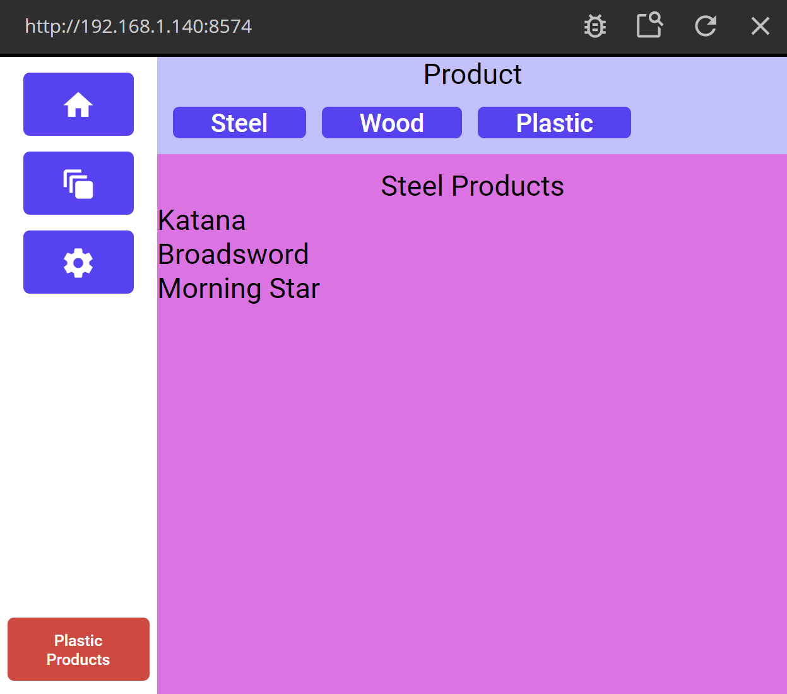

</div>

Quickly copy-and-paste the **Array**+**Array Filter**+**Repeater** construction to the "Wood" and "Plastic" page, make sure to update the filter, and we are done with listing the products.

<div className="ndl-image-with-background l">

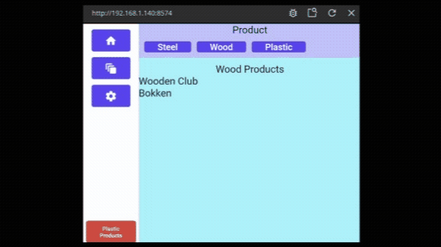

</div>

### Adding the Show Product Page

Next step is to add a new **Page Component** to the main **Page Router**. We want to have it mapped to the URL `/showproduct`. Click the main **Page Router** (in the App component), the click **Add New Page** and **Create New Page**.

<div className="ndl-image-with-background">

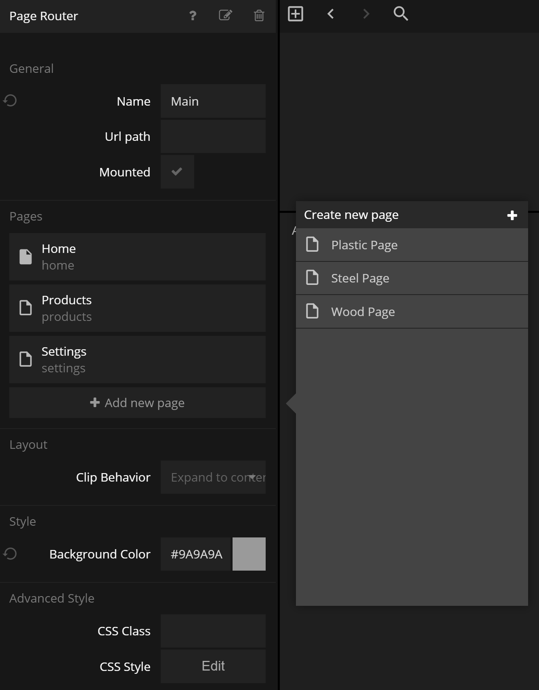

</div>

<div className="ndl-image-with-background">

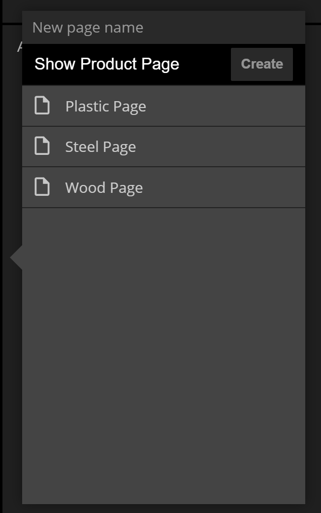

</div>

Lets first go to the new page and make sure the path is "showproduct" by clicking the **Page** node and updating the path.

So how do we know which of the Melee Weapon Products to show here? Well, that's where the **Path Parameter** comes in.

### Using a Path Parameter

We want to send the `identifyer` value of the a clicked product as a **Path Parameter** and use that to look up the correct product. I.e. we want to Navigate to this page with the path `/showproduct/<identifyer>`.

We achieve that by clicking the **Page Inputs** node and add a **Path Parameter** called "productIdentifyer". The name doesnt matter except that becomes the name of the output of the **Page Inputs** node that will contain whatever is sent in the last part of the path.

<div className="ndl-image-with-background">

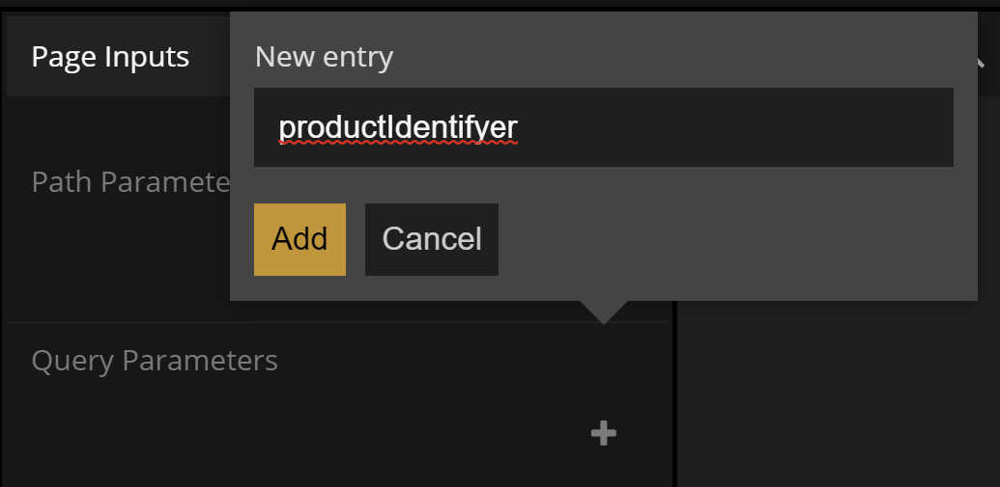

</div>

For test purposes, add a **Text** node to the **Page** node and connect the "productIdentifyer" output to the **Text** input of the **Text** node.

<div className="ndl-image-with-background l">

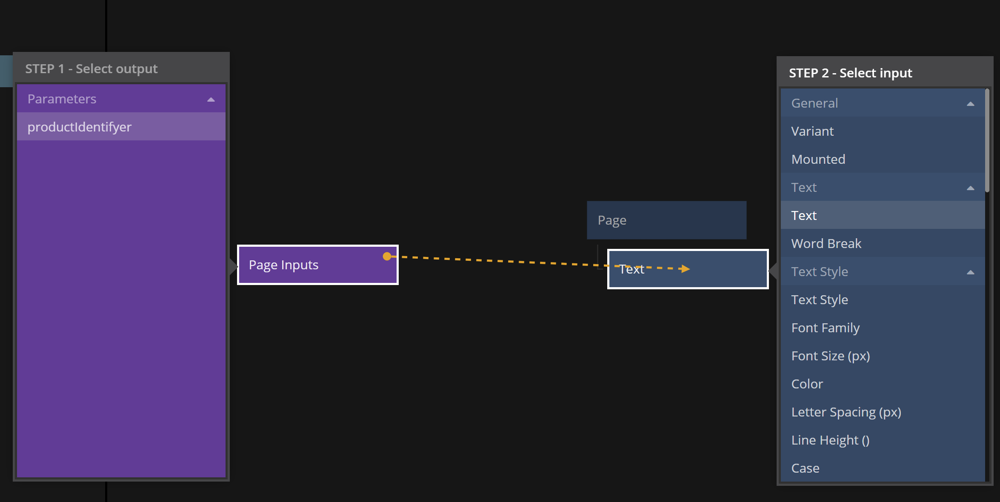

</div>

## Set the Path Parameter when Navigating

Ok, we are almost ready to try the "showproduct" Page. We just need to do the actual navigation.

So lets go back to the "Product Item" component we build earlier. We want to navigate when we click these items.

Add a **Navigate** node and make sure the associated **Page Router** is "Main". Then pick the "Show Product Page" as the target.

<div className="ndl-image-with-background">

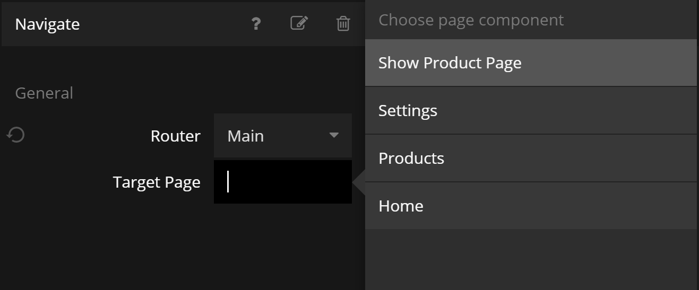

</div>

As soon as you select it, you will see that there is a new input called "productIdentifyer". This is the one we added on the **Page Inputs** earlier!

We want to set it to the "identifyer" value from our product so lets add the property "identifyer" on our **Object** and connect it to the "productIdentifyer" input of our **Navigate** node. Also, connect the **Click** signal from the **Group** node to the **Navigate** signal on the **Navigate** node.

<div className="ndl-image-with-background l">

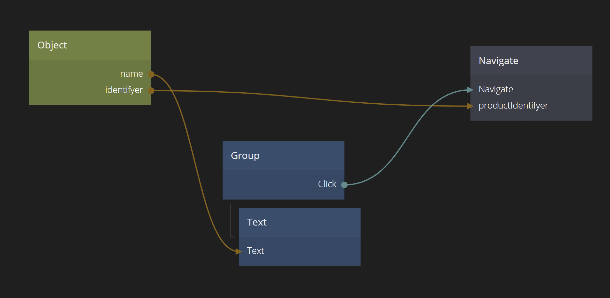

</div>

Now try clicking on different products under the different Products pages. You should see the "Show Product Page" with the corresponding identifyer printed on the screen. Also try it in a regular browser to see how the URL looks.

<div className="ndl-image-with-background l">

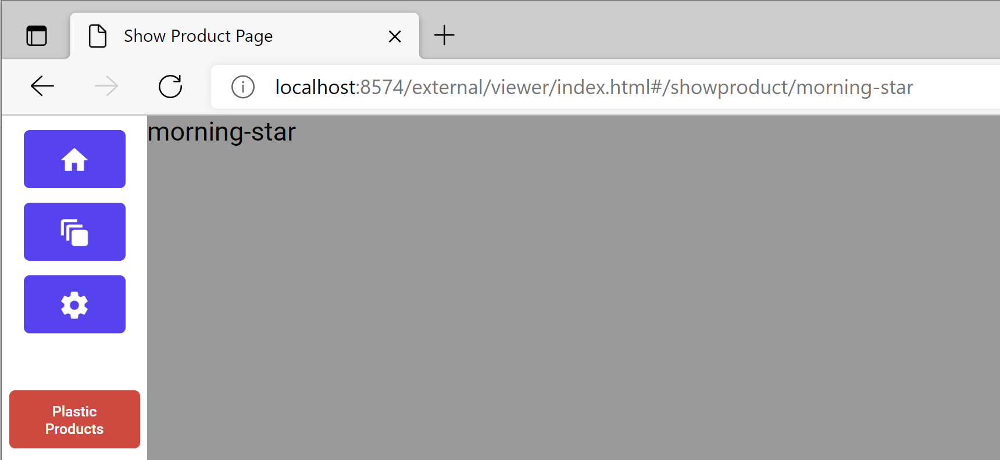

</div>

### Prettifying the "Show Product Page"

To finish up the "Show Product Page" we will extract some real data from the product and present in a sligthly prettier way. Go to the "Show Product Page".

Add a new **Group** under the **Page** node and remove the **Text** node that was previously there. Make the **Group** white and give it some margin to give it some space. Add rounded corners and give it some padding for what's going inside it.

Then add three **Text** nodes, one for "name", one for "description" and one for "price". Make the first **Text** node bold. Also, add some nice margins in-between them.

<div className="ndl-image-with-background l">

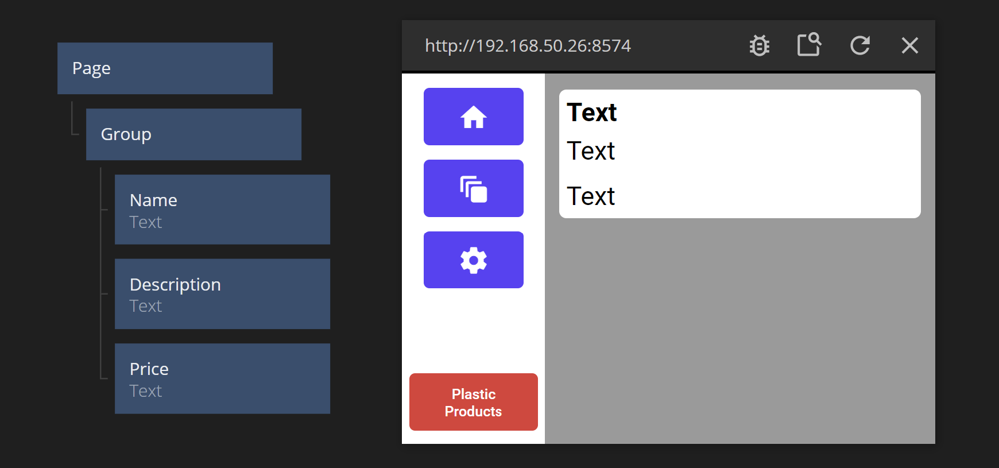

</div>

Now we need to connect the data. We have the "identifyer" coming in as our **Path Parameter**. We are going to use that to filter out the right **Object** from our "Products Array".

So we connect it to an **Array Filter**, which we filter on "identifyer". We should only get one item out, so we can take the **First Item Id** and connect it to the **Id** of an **Object** node.

The **Object** should have three properties, "name", "description" and "price". The "price" need to be formatted. So add a [String Format](/nodes/string-manipulation/string-format/) node with the string `Price: {price} EUR`.
An input "price" should now be available on the **String Format** node. Connect the "price" output from the **Object** to it.

The data extraction should look similar to below:

<div className="ndl-image-with-background l">

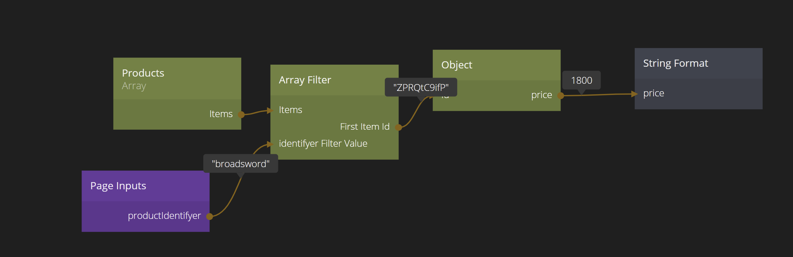

</div>

Then connect the data to the **Text** nodes and we are done with this part.

<div className="ndl-image-with-background l">

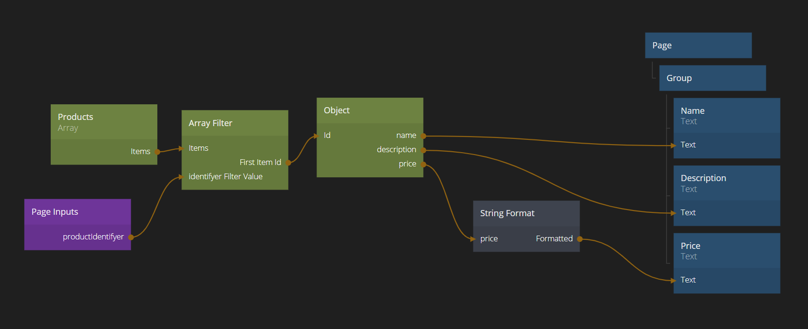

</div>

<div className="ndl-image-with-background m">

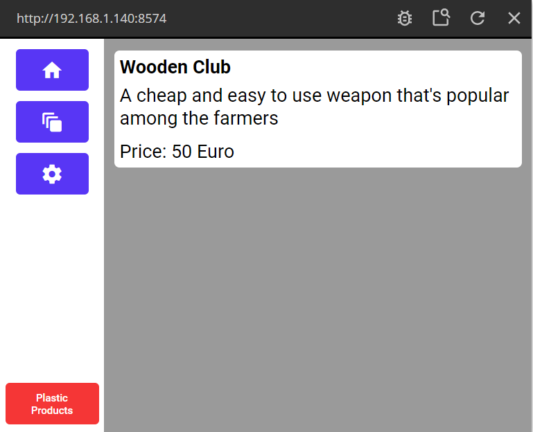

</div>

## Using Query Parameters

Another way to send parameters to pages is as _Query Parameters_. While you can only have one **Path Parameter**, you can have as many **Query Parameters** as you want.

Lets add a **Query Parameter** to our **Page Inputs** node. We will call it `showVAT` and we will use it to determine whether the price should include VAT or not in the **Show Products Page**.

<div className="ndl-image-with-background">

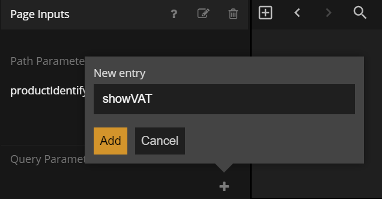

</div>

Now lets make use of the parameter. We start by going to the "Settings" page component. We will let the user state its preference here, whether they want to include VAT or not in the displayed price.

### Adding a VAT setting

Add a [Radio Button Group](/nodes/ui-elements/radio-button-group/) with a **Text** node and two [Radio Buttons](/nodes/ui-elements/radio-button/) as children. The text will be the title for the group. Make sure the first **Radio Button** have the value `showVAT` and the second `dontShowVAT`.

<div className="ndl-image-with-background">

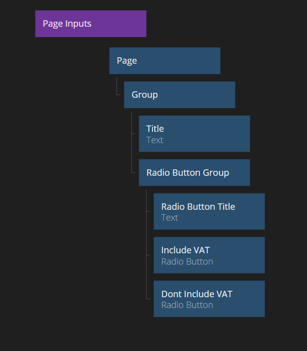

</div>

<div className="ndl-image-with-background">

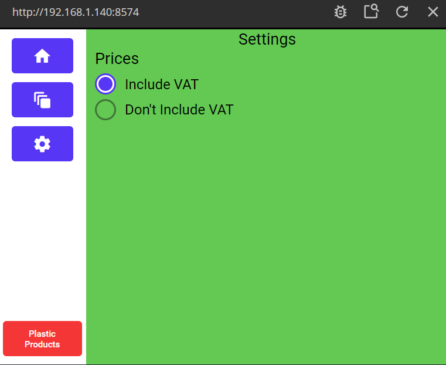

</div>

So lets save the VAT state, using a bit of logic and a [Variable](/nodes/data/variable/variable/) / [Set Variable](/nodes/data/variable/variable/) node. Note that we connect the **Variable** that holds the current value to the **Value** of the **Radio Group** node to make sure it reflects the current setting when navigating to the **Settings** Page. (Remember that the **Page Component** will be re-instanciated every time you navigate to it so we need to set the initial value every time.)

<div className="ndl-image-with-background l">

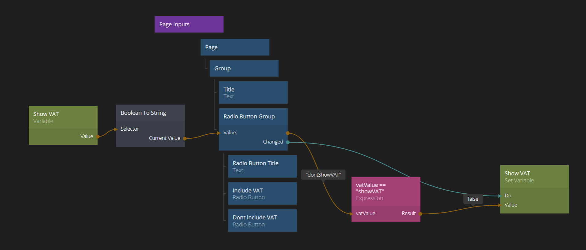

</div>

Now we need to update our navigation to encode the setting in the URL. But maybe we should revisit why we would want to do that. Why not use our **Variable** `Show VAT` directly in the **Show Products** page component? Well, if we want our users to be able to copy the URL they are on when looking at a product, and we want the receiver to see the exact same view as the sender, we need to encode the setting in the URL.

### Sending the Query Parameter

Go to the "Product Item" component where we do the navigation to the "Show Product" Page. If you click the **Navigate** node you will now see that the `showVAT` parameter is availabel as an input.

<div className="ndl-image-with-background">

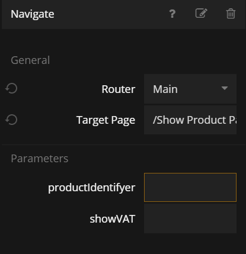

</div>

We simply connect our **Variable** to it and the value will be sent.

<div className="ndl-image-with-background l">

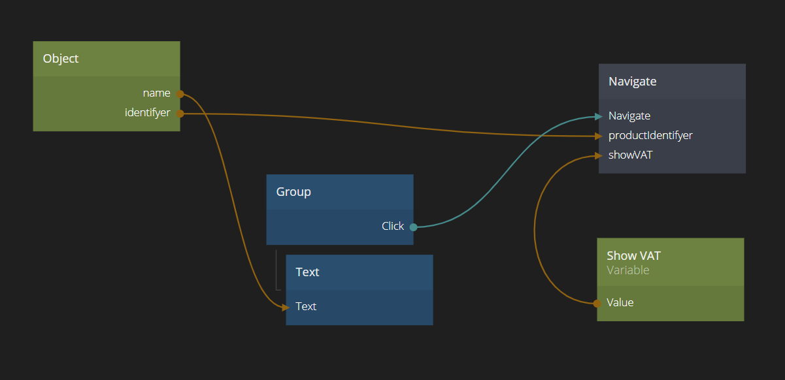

</div>

### Receiving the Query Parameter

The only thing left is to receive the parameter in the "Show Product" Page and show different prices depending on the parameter. We add a **Variable** that will hold the string to be shown (the price string including the VAT or not). Then we add a [Condition](/nodes/utilities/logic/condition/) node to set the correct string to the **Variable**. The nodes look as below:

<div className="ndl-image-with-background l">

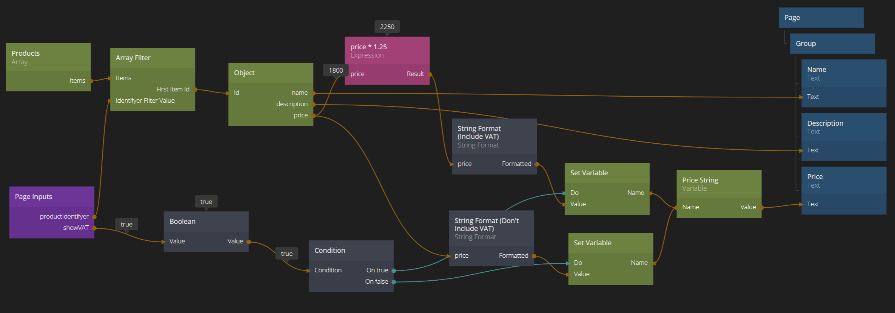

</div>

If you want to download the complete project then press the "Import" button below and follow the instructions in Noodl.

<div className="ndl-image-with-background l">
    </img>
<button className="ndl-import-button" onClick='importIntoNoodl("guides/navigation/web-navigation/encoding-params-in-url/param-encoding-url.zip",{name:"Encoding Parameters in URL",thumb:"guides/navigation/web-navigation/encoding-params-in-url/show-products-page-4.png"})'></button>
</div>
