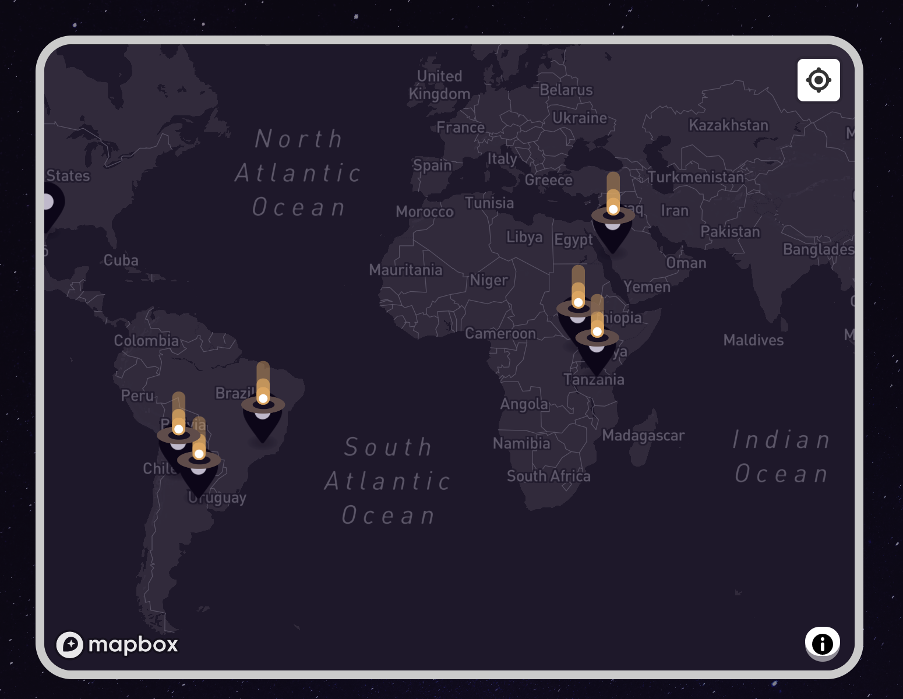

# Getting Screen Coordinates of Markers

This snippet is useful if you want to position something, for example a Noodl Component, on top of a Marker on the Mapbox Map.

<div className="ndl-image-with-background l">



</div>

## How it works

Create a [Function](/nodes/javascript/function/) node and paste in the code below

```javascript
const markers = document.querySelectorAll('.mapboxgl-marker')

if (!markers) return

for (let i = 0; i < markers.length; i++) {
    let m = markers[i]
    let markerId = m.getAttribute('data-ndl-marker-id')
    let rect = m.getBoundingClientRect()

    Noodl.Object.get(markerId).setAll({
        posX: rect.left,
        posY: rect.top,
    })
}

Outputs.done()
```

When calling **Run** on the **Function** node the screen coordinates will be written to the Marker array, in the two properties `posX` and `posY`. After the operation is finished the **Done** output signal will be triggered.
