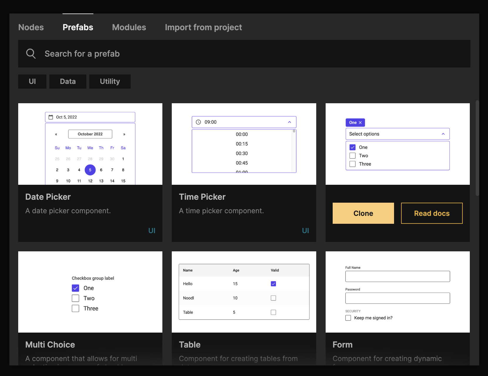
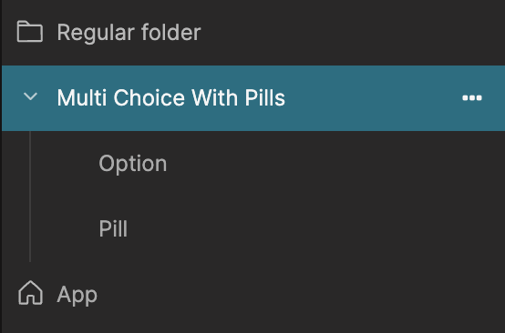
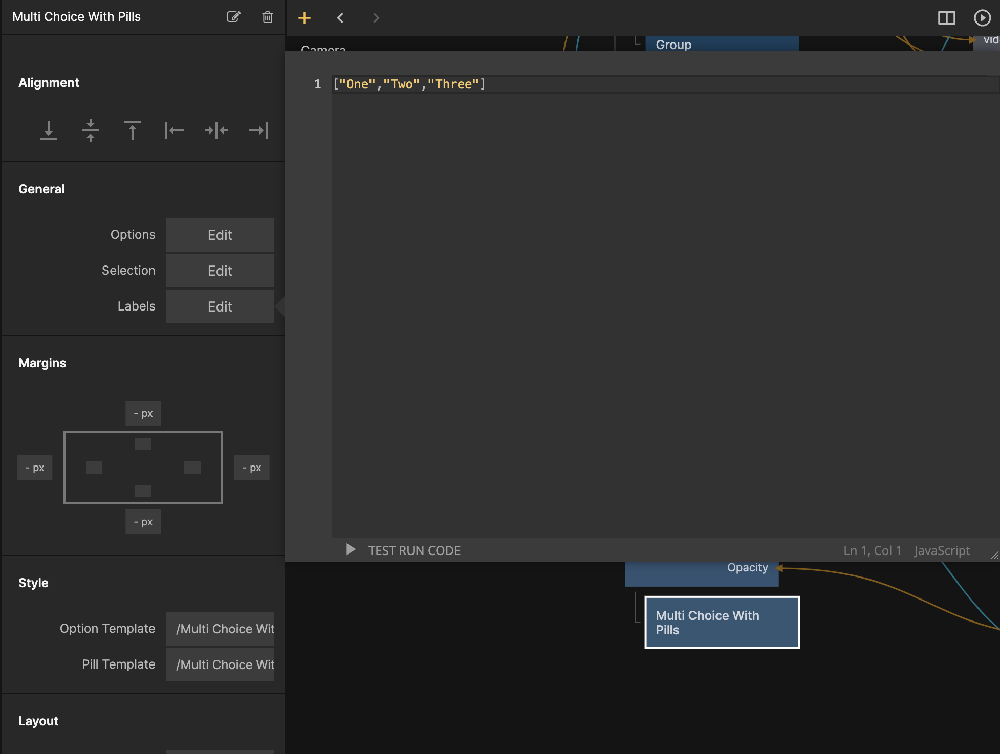
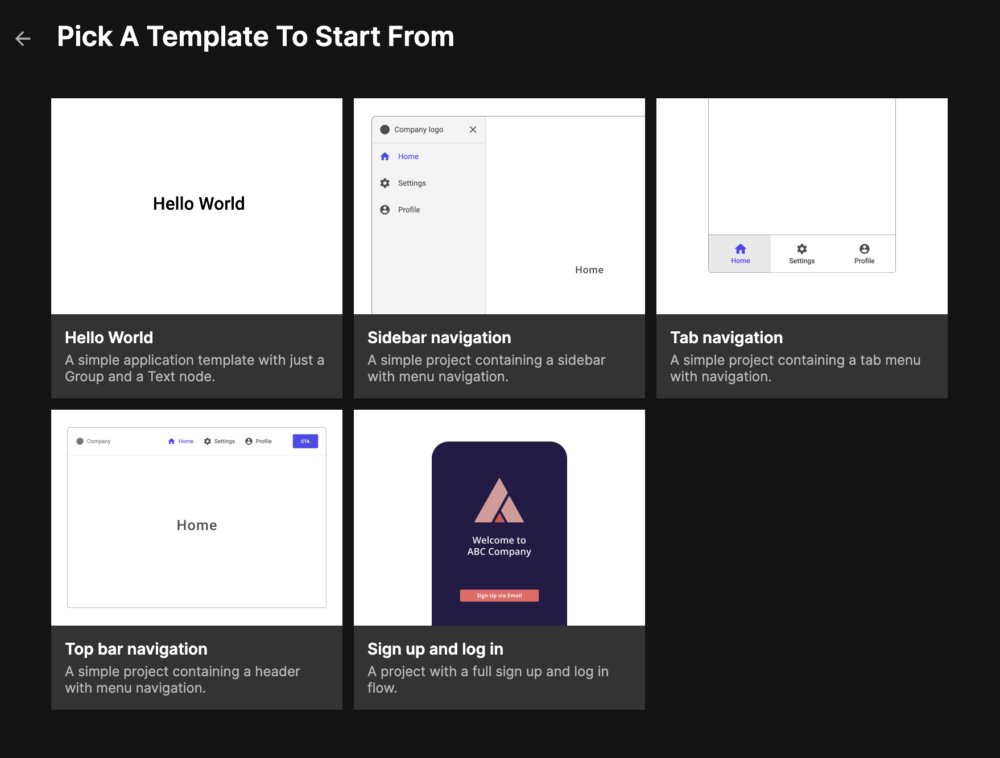

<section>

## Prefabs

A new concept is introduced called Prefabs, it is pre-fabricated components, made from Noodl core nodes, that you can easily clone into your project as a starting point for building a wide range of user interfaces. You can also find guides helping you to take these prefabs and customize them to suit your own specific needs.
</section>

<section>

## Sub components

To make it easier to organize your project, work with Prefabs, and to create custom components we have enabled the possibility to move components into other components just like folders. This can make components that are dependent on other components to function move self-sustainable. 

Folder component children can be created just like components in folders - by dragging in to, or creating new ones from the parents context menu.

</section>

<section>

## Editable array inputs

Nodes with array type inputs can now be edited directly from the property panel. This makes it easier to provide static data. You can provide any javascript which means you can run computations, fetch variables etc.

</section>

<section>

## New project templates

This release comes with update project templates to handle some of the common navigation structures for web apps. Previous project templates have been moved to the examples section of the documentation.

</section>
