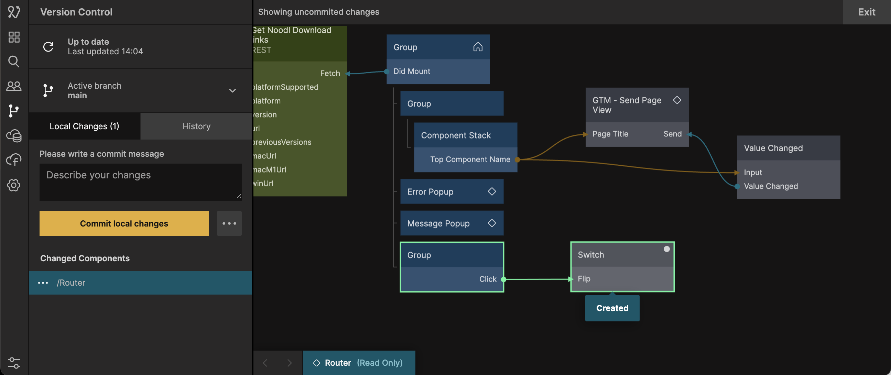

<section>

## Cloud Functions

You can now create logic components that run in your Noodl Cloud Services, just like you are used to on the frontend. Backend tasks like signing up users with external services, doing complex database lookups faster, scheduling background jobs and much more can now be done at Noodl-speed, and deployed with one click.

</section>

<section>

## A brand new design

The editor interface has gone through a face lift to increase consistency and clarity. We have also added a couple of new features that lay the groundwork for the versions to come during 2023. Most notably, the Component Canvas has been replaced with a much nicer Preview Canvas, letting you navigate your app with a new path dropdown and inspect it in different device sizes. We have also added a design mode (similar to the “inspect” button in previous versions) where UI elements can be selected and revealed in the Node Canvas.

</section>

<section>

## Updated version control

The whole version control UX has been redesigned to be faster and easier to use, and to be able to bring you more of the power features of Git (like enhanced merging and diffing) right inside of the Noodl editor. The best low-code version control system just got even better.

</section>

<section>

## More complete Javascript API

This release allows power users to be even more powerful by providing a more complete JavaScript API. Anything you can do with a node and connections, you can now do inside of the Function and Script nodes.

</section>
