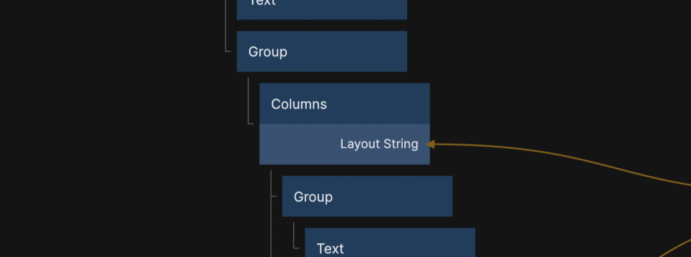
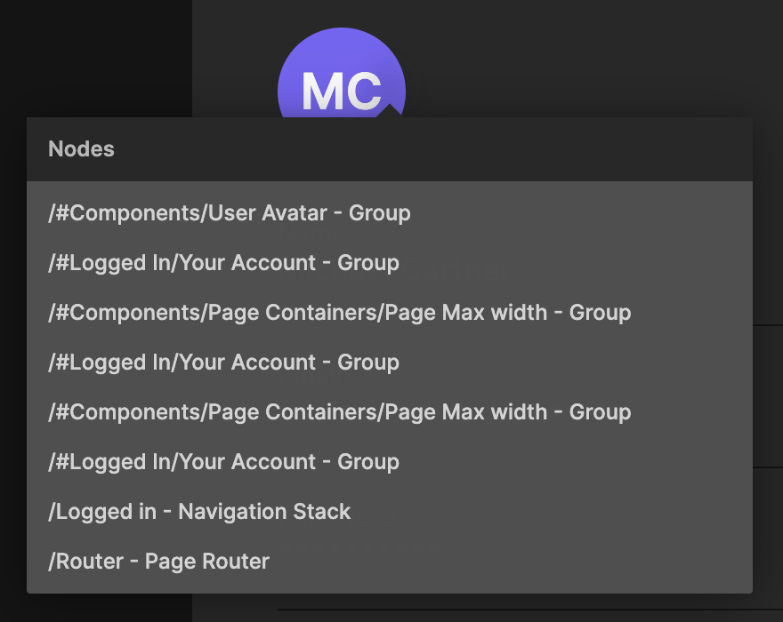

<section>

## Columns node

A new visual node: [Columns](https://docs.noodl.net/2.8/nodes/basic-elements/columns)

This is useful for layouts that have columns with gaps between them, and especially powerful in combination with media queries for handling responsive layouts.

</section>

<section>

## Right click in design mode

The design mode has a new feature. Right click to get a list of all visual elements under the mouse cursor, and click to jump to the corresponding node.

</section>

<section>

## Other notable changes

Expanded the Noodl.Records Javascript API:

- Support for aggregate queries
- Support for geo queries
- Specific columns of data can be selected to be included in the result of a query, instead of all data
- The ability to follow pointers and include their data directly in the result.

Other changes:

- A new project setting for selecting different positions for the Noodl badge.
- REST node can now parse results with content type application/geo+json.
- REST node will handle responses that aren't JSON as raw text instead of showing a warning.
- A Javascript object can now be connected to the "Id" input of an Object node.

</section>

<section>

## Bug fixes

- Fixed issue with property panel not updating correctly when swtiching variants
- Fixed stale information in the version control panel after creating or applying a stash
- Query Records and a few other nodes and APIs had issues with arrays that included a null object.
- Fixed styling issue in Radio Buttons that had multi line labels
- Fixed bug with the "Cancel" input to the REST node
- Fixed an UI error when a merge conflict happened in Node parameters that were objects and not simple primitives
- Improved how Noodl handes saving the project file to reduce the chance of a corrupt project on Windows.

</section>
